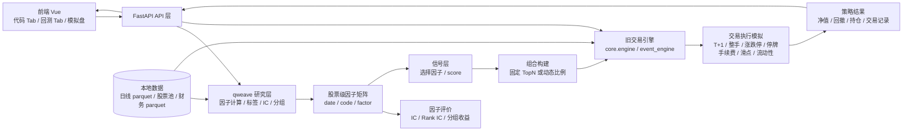

# quant_ui 新旧引擎架构

## 1. 一张图看懂



---

## 2. 新旧引擎怎么分工

### 新引擎：qweave 研究引擎

代码入口主要是：

```text
D:\Quant\quant_ui\backend\qweave_runner.py
D:\Quant\quant_ui\scripts\qweave_research.py
```

负责：

- 读取日线行情
- 对股票池内每只股票计算股票级因子
- 生成未来收益标签
- 计算 IC
- 计算 Rank IC
- 做每日截面分组
- 计算分组收益和多空收益
- 计算覆盖率和研究换手
- 输出最新交易日股票因子排名
- 产生 `date/code/score` 股票级信号

qweave 研究层回答的问题是：

```text
这个因子有没有预测能力？
这个因子的股票排名是否有效？
用这个因子生成的股票分数是什么？
```

当前 qweave 主要使用行情字段：

```text
open / high / low / close
volume / amount / turnover / vwap
```

ROE、PB、EP 等财务因子数据已经在本地存在，但还需要进一步接入 qweave 的研究长表，才能和 Alpha 因子一起在新 Tab 中使用。

### 旧引擎：交易与组合执行引擎

代码主要是：

```text
D:\Quant\quant_ui\core\engine.py
D:\Quant\quant_ui\core\event_engine.py
```

负责：

- 根据 score 排序选股
- 固定 TopN
- 按有效股票比例动态选股
- 等权分配组合权重
- 现金和资金约束
- 100 股整手
- T+1
- 涨停不能买入
- 跌停不能卖出
- 停牌不能交易
- 买入费率
- 卖出费率
- 滑点
- 成交额过滤
- 流动性参与率
- 行业持仓上限
- 组合净值
- 回撤
- 持仓明细
- 交易记录

旧交易引擎回答的问题是：

```text
按这个 score 实际交易，能买到哪些股票？
实际持仓数量是多少？
扣除交易限制和费用后还能赚多少？
```

---

## 3. 现在“代码”Tab 的真实执行链路

点击：

```text
研究并回测 TopN
```

实际过程是：

```text
1. 前端提交 qweave 研究代码和参数
       ↓
2. FastAPI 调用 backend.qweave_runner
       ↓
3. 加载股票池和日线行情
       ↓
4. qweave.with_alphas
       ↓
5. qweave.with_labels
       ↓
6. qweave.evaluate
       ↓
7. 得到每只股票每天的因子值
       ↓
8. 选择回测信号因子
       ↓
9. 转成 date/code/score 矩阵
       ↓
10. 调用 core.engine.run_backtest
       ↓
11. 旧交易层执行 TopN 或动态比例选股
       ↓
12. 返回净值、回撤、持仓、交易和指标
```

因此当前不是两套互相竞争的回测引擎，而是：

```text
qweave = 研究和生成信号
旧引擎 = 组合和交易执行
```

---

## 4. 数据流的关键对象

### 原始行情长表

```text
date
code
open
high
low
close
volume
amount
turnover
vwap
```

### 股票级因子长表

```text
date
code
MA60
ROC20
KMID
...
```

一行代表：

```text
某只股票在某一天的某个因子值
```

### 交易 score

```text
date
code
score
```

例如：

```text
2025-01-02  000001  0.821
2025-01-02  000333  0.734
2025-01-02  600519  0.912
```

### 组合目标权重

```text
date
code
target_weight
```

旧交易引擎根据它决定：

```text
买入
卖出
继续持有
不交易
```

---

## 5. 当前前端页面和引擎对应关系

| 前端页面 | 主要后端 | 主要职责 |
|---|---|---|
| 代码 Tab | `qweave_runner.py` + `core.engine` | qweave 因子研究、score 生成、TopN 回测 |
| 回测 Tab | `backend/routers/backtest.py` + `core.engine` | 旧因子、组合和交易回测 |
| 模拟盘 | `core.paper.py` + `core.engine` | 按交易引擎口径重放模拟交易 |
| 信号 Tab | `core.engine.latest_signals` | 最新交易日股票排名和信号 |
| 事件策略 | `core.event_engine.py` | `on_bar` 事件驱动策略 |
| qweave 脚本 | `scripts/qweave_research.py` | 命令行研究、批量结果、模型预测 |

---

## 6. 新旧引擎不应该混在一起的部分

### 应该放在 qweave 研究层

- [x] 因子表达式
- [x] 股票级因子计算
- [x] 未来收益标签
- [x] IC / Rank IC
- [x] 分组收益
- [x] 因子相关性
- [ ] 去极值
- [ ] 截面 Rank / Z-Score
- [ ] 行业中性化
- [ ] 市值中性化
- [ ] 多因子综合 score

### 应该放在旧交易层

- [x] TopN
- [x] 动态持仓数量
- [x] 组合权重
- [x] T+1
- [x] 涨跌停
- [x] 停牌
- [x] 整手
- [x] 佣金和印花税近似
- [x] 滑点
- [x] 流动性参与率
- [x] 现金约束
- [x] 净值、回撤和交易明细

不要让 qweave 研究代码自己实现：

```python
order_target_pct(...)
```

也不要让旧交易引擎负责解释 qweave 的 Alpha 表达式。

两者通过这个接口连接：

```text
date / code / score
```

---

## 7. 当前架构还缺的下一层

当前最重要的后续工作是增加独立的 Transform 和 Signal 层：

```text
qweave 原始因子
    ↓
缺失值处理
    ↓
去极值
    ↓
截面 Rank / Z-Score
    ↓
行业 / 市值中性化
    ↓
因子方向统一
    ↓
多因子合成 score
    ↓
core.engine 日线交易执行
```

目前已经打通的是：

```text
单个 qweave 因子 → score → TopN / 动态比例 → 日线回测
```

还需要继续打通的是：

```text
多个 qweave 因子
    ↓
标准化和方向处理
    ↓
综合 score
    ↓
风险约束组合
    ↓
样本外交易回测
```

---

## 8. 一句话总结

```text
qweave 负责“研究什么有效、每只股票得多少分”；
旧交易引擎负责“根据分数怎么买、买多少、能不能成交、扣掉成本后结果如何”。
```
